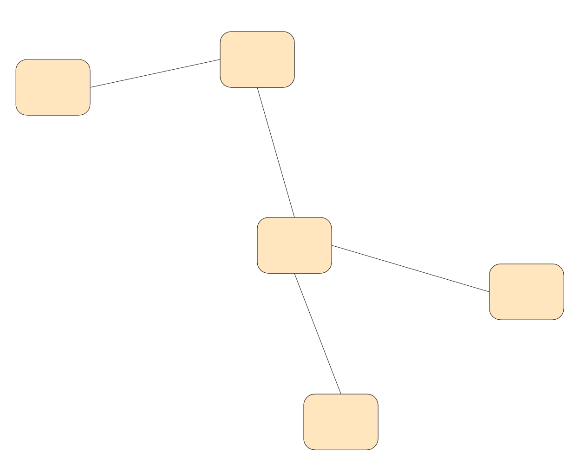
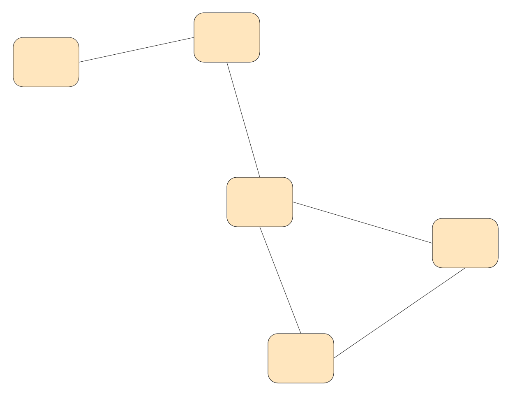
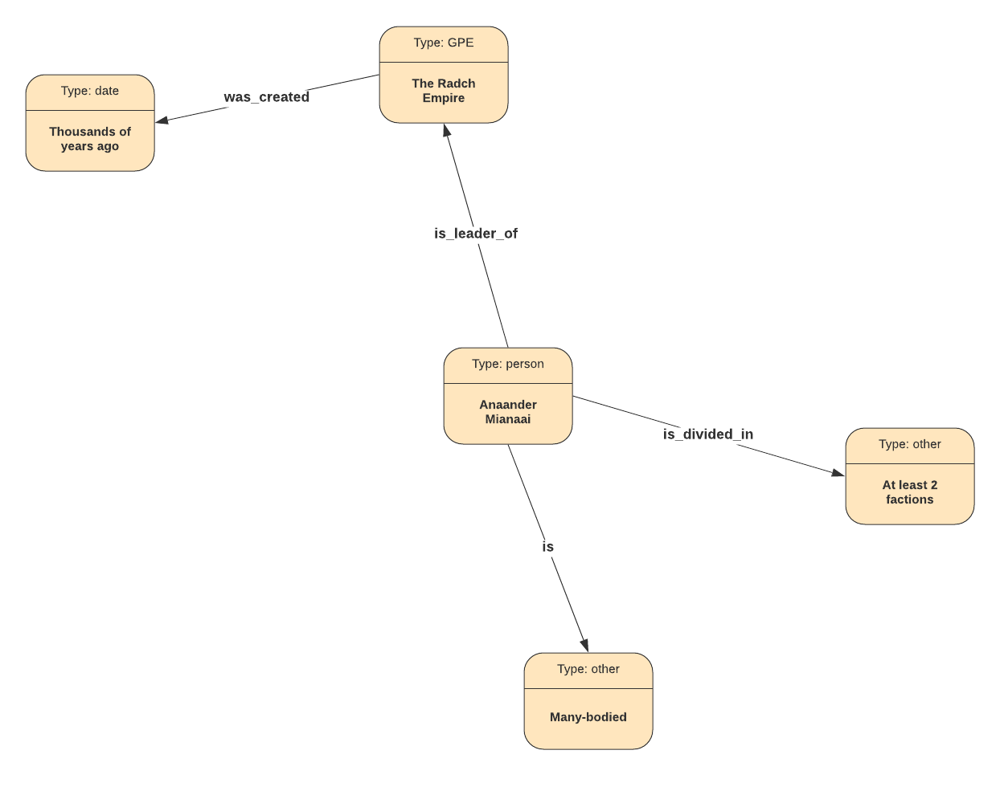
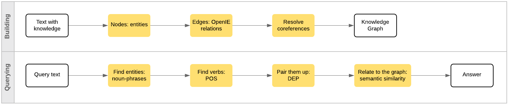
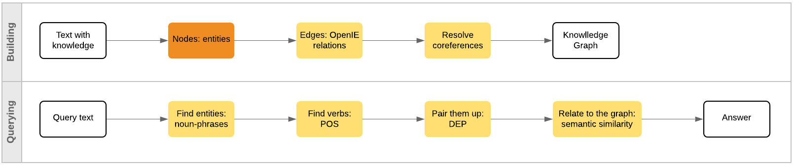
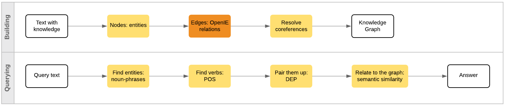
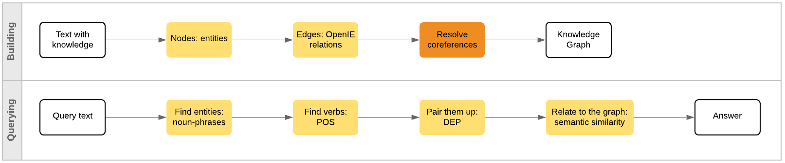
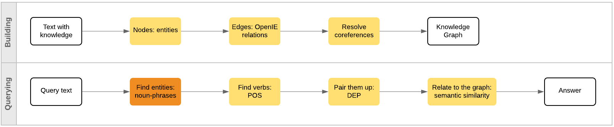
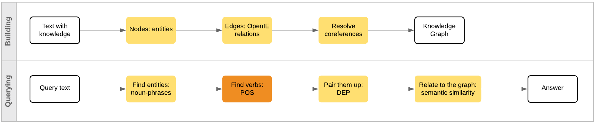
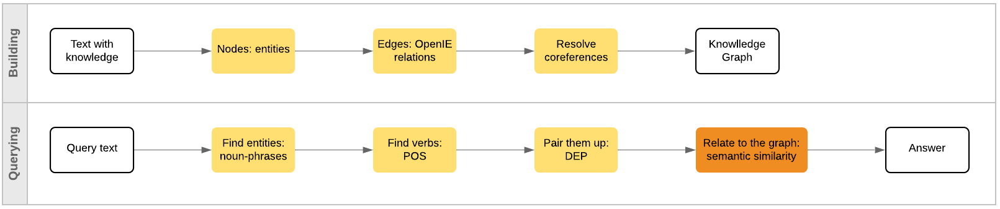

# Natural Language Processing
## with spaCy and CoreNLP in R
@snap[east span-100]
### Ana Mamatelashvili 
@snapend

@snap[south-east span-30]
August 29, 2019
@snapend

@snap[south-west span-40]
@nushkee @EliizaAI
@snapend


---
@snap[midpoint span-50]
# A bit about me 
@snapend

---

# Graphs

<br>

- Nodes
- Connected with edges 
  
@snap[south-west span-40]

@snapend

@snap[south-east span-40]

@snapend
 
---

# Knowledge Graphs 

The Radch Empire was created thousands of years ago. <br>
Its leader is Anaander Mianaai. <br>
She's many-bodied and divided in at least 2 factions.


@snap[south span-50]

@snapend


---

# Challenges of NLP 

<br>

- Ambiguity 
- Variability 
- Evolution  
- Structural complexity: language is discrete, compositional and sparse
- Large vocabulary, vast amounts of data
- Quality of data: errors and inconsistencies 

---

# Why do NLP?

<br>

- Information extraction
  - Entities
  - Relations
  - Question answering 
- Machine translation
- Text generation 
  - Summarisation
  - Dialogue systems @fa[robot]
- Speech recognition 
- OCR  


We will focus on text processing features needed for knowledge graph building and querying. 

 
---

### CoreNLP
- Wide range of grammatical analysis tools and models 
- A fast, robust annotator for arbitrary texts, widely used in production
- Supports multiple human languages 
- APIs available for many programming languages (e.g. Python and R)


<br>

### spaCy
- Fast: Cython
- Wide variety of text processing features 
- Several pretrained Enlish models
- Good docs


--- 
# Stanford [CoreNLP](https://stanfordnlp.github.io/CoreNLP/) for R
By Christopher Manning, Mihai Surdeanu, John Bauer, Jenny Finkel, Steven Bethard, David McClosky

<br>

```r
downloadCoreNLP()
initCoreNLP(type='english_all')
```

- Needs a lot of memory 
- Depends on Java


---
# spacyr 
By Kenneth Benoit, Akitaka Matsuo

<br>

- Will install Miniconda, Python and spaCy 
- Will run spaCy in the background

```r
spacy_install(conda = "auto", version = "latest", 
              lang_models = "en_core_web_lg",
              python_version = "3.6", envname = "spacy_condaenv",
              python_path = NULL, prompt = TRUE)
#spacy_download_langmodel(model = "en", envname = "spacy_condaenv",
#                         conda = "auto")
spacy_initialize(model = "en_core_web_lg", python_executable = NULL,
                 virtualenv = NULL, condaenv = NULL, ask = FALSE,
                 refresh_settings = FALSE, save_profile = FALSE, 
                 check_env = TRUE, entity = TRUE)
           
# spacy_finalize()
```
---

# Key components 

<br>

CoreNLP 
  - Sentiment scores 
  - Entity linking 
  - Coreference resolution
  - Open information extraction 

spacyR
  - Preprocessing
  - Linguistic features 
  - Word embeddings 


---
# Parsing text

<br>

```r
text <- "The Radch Empire was created thousands of years ago. 
         Its leader is Anaander Mianaai. 
         She's many-bodied and divided in at least 2 factions."

# Parse text with CoreNLP
annObj <- annotateString(text)

# Parse text with spaCy
annotated <- spacy_parse(text, pos = TRUE, tag = TRUE, lemma = TRUE,
                  entity = TRUE, dependency = TRUE, nounphrase = TRUE,
                  multithread = TRUE)
```

---

# Workflow for KG

@snap[midpoint span-100]

@snapend
  
---
# Nodes: Entities 
@snap[north-east span-50]

@snapend

<br>
```r
text <- "The Radch Empire was created thousands of years ago. 
         Its leader is Anaander Mianaai. 
         She's many-bodied and divided in at least 2 factions."
entities <- spacy_parse(text, pos = FALSE, tag = FALSE, lemma = FALSE,
                           entity = TRUE, dependency = FALSE, nounphrase = FALSE,
                           multithread = TRUE)
entity_extract(entities, type = 'all', concatenator = "_")
#  doc_id sentence_id                 entity entity_type
#1  text1           1       The_Radch_Empire         GPE
#2  text1           1 thousands_of_years_ago        DATE
#3  text1           2       Anaander_Mianaai      PERSON
#4  text1           3             at_least_2    CARDINAL
```
---
# Edges: Open IE

@snap[north-east span-50]

@snapend

<br>


```r
text <- "The Radch Empire was created thousands of years ago. 
         Its leader is Anaander Mianaai. 
         She's many-bodied and divided in at least 2 factions."
annObj <- annotateString(text)
getOpenIE(annObj) %>% select(subject, relation, object)
#       subject    relation                 object
#1 Radch Empire was created     thousands of years
#2 Radch Empire was created thousands of years ago
#3 Radch Empire was created              thousands
#4   Its leader          is       Anaander Mianaai
#5          She  divided in    at least 2 factions
#6          She         has            many-bodied
```
---
# Ambiguities: Coreference Resolution 

@snap[north-east span-50]
<br>

@snapend


<br>

```r
getCoreference(annObj)
#  corefId sentence start end head startIndex endIndex
#1       1        1     1   4    3          1        3
#2       1        2     1   2    1         11       11
#3       2        2     4   6    5         14       15
#4       2        2     1   3    2         11       12
#5       2        3     1   2    1         17       17
```

Two coreference clusters:
1. The Radch Empire, Its
2. Anaander Mianaai, Its leader, She  

---

@snap[midpoint span-70]

@snapend


@snap[south span-100]
### How do we query a knowledge graph? 
@snapend


---
# Find entities: noun phrases 


@snap[north-east span-50]
<br>

@snapend


<br>
<br>


```r
text <- "When was the Radch Empire founded?"
nounphrases <- spacy_parse(text, pos = FALSE, tag = FALSE, lemma = FALSE,
                   entity = FALSE, dependency = FALSE, nounphrase = TRUE,
                   multithread = TRUE)
nounphrase_extract(nounphrases, concatenator = "_")
#  doc_id sentence_id       nounphrase
#1  text1           1 the_Radch_Empire
```

---
# Find verbs: parts of speech 

@snap[north-east span-50]
<br>

@snapend

<br>
<br>
```r
text <- "When was the Radch Empire founded?"
pos <- spacy_parse(text, pos = TRUE, tag = TRUE, lemma = FALSE,
                   entity = FALSE, dependency = FALSE, nounphrase = FALSE,
                   multithread = TRUE)
#  doc_id sentence_id token_id   token   pos  tag
#1  text1           1        1    When   ADV  WRB
#2  text1           1        2     was  VERB  VBD
#3  text1           1        3     the   DET   DT
#4  text1           1        4   Radch PROPN NNPS
#5  text1           1        5  Empire PROPN  NNP
#6  text1           1        6 founded  VERB  VBD
#7  text1           1        7       ? PUNCT    .
```

See [annotation specifications](https://spacy.io/api/annotation) for the full tag list. 

---
# Pair them up: dependencies 

@snap[north-east span-50]
<br>

@snapend

<br>
<br>

```r
text <- "When was the Radch Empire founded?"
dep <- spacy_parse(text, pos = FALSE, tag = FALSE, lemma = FALSE,
                   entity = FALSE, dependency = TRUE, nounphrase = FALSE,
                   multithread = TRUE)
#  doc_id sentence_id token_id   token head_token_id  dep_rel
#1  text1           1        1    When             6   advmod
#2  text1           1        2     was             6  auxpass
#3  text1           1        3     the             5      det
#4  text1           1        4   Radch             5 compound
#5  text1           1        5  Empire             6    nsubj
#6  text1           1        6 founded             6     ROOT
#7  text1           1        7       ?             6    punct
```

---
@snap[midpoint span-100]
 
@snapend


---
# Relate to the KG: word embeddings

@snap[north-east span-50]
<br>

@snapend

<br>

[Global Vectors for word representation](https://nlp.stanford.edu/projects/glove/)

```r
text <- "founded created leader is divided"
vectors <- spacy_parse(text, pos = FALSE, tag = FALSE, lemma = FALSE,
             entity = FALSE, dependency = FALSE, nounphrase = FALSE,
             multithread = TRUE, 
             additional_attributes = c('has_vector', 'vector_norm', 'vector'))
vectors %>% select(token, has_vector, vector_norm) 
#    token has_vector vector_norm
#1 founded       TRUE    6.329316
#2 created       TRUE    5.515051
#3  leader       TRUE    6.531607
#4      is       TRUE    4.890306
#5 divided       TRUE    5.766988
```
---

# Relate to the KG: semantic similarity 

<br>


Cosine similarity scores between:

- founded and created: 0.4530104
- founded and leader: 0.4157298
- founded and is: 0.2928721
- founded and divided: 0.2074316


@snap[east span-50]

@snapend


--- 
# When was the Radch Empire founded?


@snap[east span-70]

@snapend


@snap[south-east span-100]
### Thousands of years ago.
@snapend


--- 
# Next steps
 <br>

What to do with a large and messy text corpus?

- Ontology
- Custon entity recogniser
- Graph completion 
- Natural language to query model


---
@snap[west span-100]
# Thank you! 
@snapend

