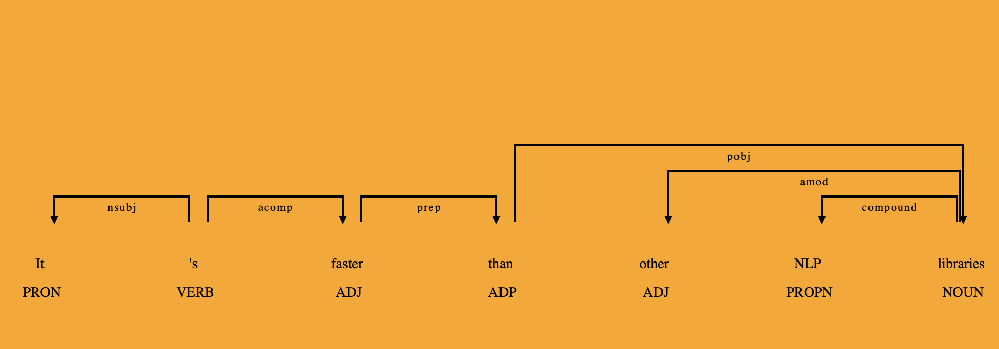

# Natural Language Processing
## with spaCy and CoreNLP in R
@snap[east span-100]
### Ana Mamatelashvili 
@snapend

@snap[south-east span-30]
August 29, 2019
@snapend

@snap[south-west span-40]
@nushkee @EliizaAI
@snapend


---
@snap[midpoint span-50]
# A bit about me 
@snapend

---

# Graphs

<br>

- Nodes
- Connected with edges 
  
  (insert graph example, four vertices triangle+edge and a triod)

The first graph has the property that all vertices can be visited without retracing your steps but the second graph does not. 
---

# Knowledge Graphs 

The Radch Empire was created thousands of years ago. <br>
Its leader is Anaander Mianaai. <br>
She's many-bodied and divided in at least 2 factions.


(insert Knowledge graph derived from this text.) 


---

# Challenges of NLP 

<br>

- Ambiguity 
- Variability 
- Evolution  
- Structural complexity: language is discrete, compositional and sparse
- Large vocabulary, vast amounts of data
- Quality of data: errors and inconsistencies 

---

# Why do NLP?

<br>

- Information extraction
  - Entities
  - Relations
  - Question answering 
- Machine translation
- Text generation 
  - Summarisation
  - Dialogue systems @fa[robot]
- Speech recognition 
- OCR  

<br>

We will focus on text processing features needed for knowledge graph building and querying. 

 
---

### CoreNLP
- Wide range of grammatical analysis tools and models 
- A fast, robust annotator for arbitrary texts, widely used in production
- Supports multiple human languages 
- APIs available for many programming languages such as Python and R


<br>

### spaCy
- Fast: Cython
- Wide variety of text processing features 
- Several pretrained Enlish models
- Good docs


--- 
# CoreNLP for R
By Christopher Manning, Mihai Surdeanu, John Bauer, Jenny Finkel, Steven Bethard, David McClosky

Stanford [coreNLP](https://stanfordnlp.github.io/CoreNLP/)

```r
downloadCoreNLP()
initCoreNLP(type='english_all')
```

<br>

- Needs a lot of memory 
- Depends on Java


---
# spacyr 
By Kenneth Benoit, Akitaka Matsuo

<br>

- Will install Miniconda, Python and spaCy 
- Will run spaCy in the background

<br>

```r
spacy_install(conda = "auto", version = "latest", 
              lang_models = "en_core_web_lg",
              python_version = "3.6", envname = "spacy_condaenv",
              python_path = NULL, prompt = TRUE)
#spacy_download_langmodel(model = "en", envname = "spacy_condaenv",
#                         conda = "auto")
spacy_initialize(model = "en_core_web_lg", python_executable = NULL,
                 virtualenv = NULL, condaenv = NULL, ask = FALSE,
                 refresh_settings = FALSE, save_profile = FALSE, 
                 check_env = TRUE, entity = TRUE)
           
# spacy_finalize()
```
---

```r
text <- "The Radch Empire was created thousands of years ago. 
         Its leader is Anaander Mianaai. 
         She's many-bodied and divided in at least 2 factions."

# Parse text with CoreNLP
annObj <- annotateString(text)

# Parse text with spaCy
spacy_parse(text, pos = TRUE, tag = TRUE, lemma = TRUE,
                  entity = TRUE, dependency = TRUE, nounphrase = TRUE,
                  multithread = TRUE)
```

---
# Key components 

<br>

CoreNLP 
  - Sentiment scores 
  - Entity linking 
  - Coreference resolution
  - Open information extraction 

spacyR
  - Preprocessing
  - Linguistic features 
  - Word embeddings 


---

# Workflow for the knowledge graph

(Insert a workflow diagram with components used in the knowledge graph workflow:
  - building
  - querying
 Label with the tool name)
 
 (How should this be incorporated with the rest of the workflow component slides -- on each slide or preceding each slide?)
  
---
# Nodes: Entities (Either spacyR or CoreNLP)
```r
text <- "The Radch Empire was created thousands of years ago. 
         Its leader is Anaander Mianaai. 
         She's many-bodied and divided in at least 2 factions."
entities <- spacy_parse(text, pos = FALSE, tag = FALSE, lemma = FALSE,
                           entity = TRUE, dependency = FALSE, nounphrase = FALSE,
                           multithread = TRUE)
entity_extract(entities, type = 'all', concatenator = "_")
#  doc_id sentence_id                 entity entity_type
#1  text1           1       The_Radch_Empire         GPE
#2  text1           1 thousands_of_years_ago        DATE
#3  text1           2       Anaander_Mianaai      PERSON
#4  text1           3             at_least_2    CARDINAL
```
---
# Relations/edges: Open information extraction (CoreNLP)

<br>

```r
text <- "The Radch Empire was created thousands of years ago. 
         Its leader is Anaander Mianaai. 
         She's many-bodied and divided in at least 2 factions."
annObj <- annotateString(text)
getOpenIE(annObj) %>% select(subject, relation, object)
#       subject    relation                 object
#1 Radch Empire was created     thousands of years
#2 Radch Empire was created thousands of years ago
#3 Radch Empire was created              thousands
#4   Its leader          is       Anaander Mianaai
#5          She  divided in    at least 2 factions
#6          She         has            many-bodied
```
---
# Sort out ambiguities: Coreference Resolution (CoreNLP)

<br>

```r
getCoreference(annObj)
#  corefId sentence start end head startIndex endIndex
#1       1        1     1   4    3          1        3
#2       1        2     1   2    1         11       11
#3       2        2     4   6    5         14       15
#4       2        2     1   3    2         11       12
#5       2        3     1   2    1         17       17
```

Two coreference clusters:
1. The Radch Empire, Its
2. Anaander Mianaai, Its leader, She  

---

(insert the knowledge graph here again)

### How to query a knowledge graph? 

--- 
# Preprocessing 
## Tokenisation
```r
text <- "When was the Radch Empire founded?"
tokenised <- spacy_tokenize(text, what = "word", remove_punct = TRUE,
              remove_url = FALSE, remove_numbers = TRUE,
              remove_separators = TRUE, remove_symbols = FALSE, 
              padding = TRUE, multithread = TRUE, output = "list")
tokenised
#$text1
# [1] "The"       "Radch"     "Empire"    "was"       "created"  
# [6] "thousands" "of"        "years"     "ago"       ""         
#[11] "Its"       "leader"    "is"        "Anaander"  "Mianaai"  
#[16] ""          "She"       "'s"        "many"      ""         
#[21] "bodied"    "and"       "divided"   "in"        "at"       
#[26] "least"     ""          "factions"  ""     
```
 
---
# Preprocessing 
## Lemmatisation
```r
text <- "When was the Radch Empire founded?"
lemmatised <- spacy_parse(text, pos = FALSE, tag = FALSE, lemma = TRUE,
            entity = FALSE, dependency = FALSE, nounphrase = FALSE,
            multithread = TRUE)
lemmatised %>% filter(token != lemma)
#   doc_id sentence_id token_id     token    lemma
#1   text1           1        1       The      the
#2   text1           1        4       was       be
#3   text1           1        5   created   create
#4   text1           1        6 thousands thousand
#5   text1           1        8     years     year
#6   text1           2        1       Its   -PRON-
#7   text1           2        3        is       be
#8   text1           3        1       She   -PRON-
#9   text1           3        2        's       be
#10  text1           3        7   divided   divide
#11  text1           3       12  factions  faction
```

---
# Linguistic features
## Parts of speech 
```r
text <- "When was the Radch Empire founded?"
pos <- spacy_parse(text, pos = TRUE, tag = TRUE, lemma = FALSE,
                   entity = FALSE, dependency = FALSE, nounphrase = FALSE,
                   multithread = TRUE)
pos %>% filter(pos == 'ADJ' | pos == 'VERB')
#  doc_id sentence_id token_id   token  pos tag
#1  text1           1        4     was VERB VBD
#2  text1           1        5 created VERB VBN
#3  text1           2        3      is VERB VBZ
#4  text1           3        2      's VERB VBZ
#5  text1           3        3    many  ADJ  JJ
#6  text1           3        5  bodied  ADJ  JJ
#7  text1           3        7 divided VERB VBN
#8  text1           3       10   least  ADJ JJS
```

See [annotation specifications](https://spacy.io/api/annotation) for the full tag list. 

---
# Linguistic features
## Dependencies

```r
text <- "When was the Radch Empire founded?"
dep <- spacy_parse(text, pos = FALSE, tag = FALSE, lemma = FALSE,
                   entity = FALSE, dependency = TRUE, nounphrase = FALSE,
                   multithread = TRUE)
dep %>% filter(sentence_id == 2)
#  doc_id sentence_id token_id    token head_token_id  dep_rel
#1  text1           2        1      Its             2     poss
#2  text1           2        2   leader             3    nsubj
#3  text1           2        3       is             3     ROOT
#4  text1           2        4 Anaander             5 compound
#5  text1           2        5  Mianaai             3     attr
#6  text1           2        6        .             3    punct
```

---
@snap[midpoint span-100]

@snapend

---
# Linguistic features
## Noun phrases 

```r
text <- "When was the Radch Empire founded?"
nounphrases <- spacy_parse(text, pos = FALSE, tag = FALSE, lemma = FALSE,
                   entity = FALSE, dependency = FALSE, nounphrase = TRUE,
                   multithread = TRUE)
nounphrase_extract(nounphrases, concatenator = "_")
#  doc_id sentence_id          nounphrase
#1  text1           1    The_Radch_Empire
#2  text1           1               years
#3  text1           2          Its_leader
#4  text1           2    Anaander_Mianaai
#5  text1           3                 She
#6  text1           3 at_least_2_factions
```

# Word embeddings

[Global Vectors for word representation](https://nlp.stanford.edu/projects/glove/)

<br>

```r
text <- "When was the Radch Empire founded?"
vectors <- spacy_parse(text, pos = FALSE, tag = FALSE, lemma = FALSE,
             entity = FALSE, dependency = FALSE, nounphrase = FALSE,
             multithread = TRUE, 
             additional_attributes = c('has_vector', 'vector_norm', 'vector'))
vectors[1:2,] %>% select(token, has_vector, vector_norm) 
#            token has_vector vector_norm
#1           apple       TRUE    7.134685
#2          orange       TRUE    6.542022
```
---

# Word embeddings
## Semantic similarity 

<br>

Cosine similarity scores between:

- founded and created: (insert score)
- versus is a leader of and is and is divided in 

--- 
# When was the Radch Empire founded?


(insert the knowledge graph here with queries relation and nodes highlighted)

### The Radch Empire was created thousands of years ago.


--- 
# Next steps
 <br>

What to do with a larger and messier text corpus?

- Ontology
- Custon entity recogniser
- Graph completion 
- Natural language to query model


---
@snap[west span-100]
# Thank you! 
@snapend

